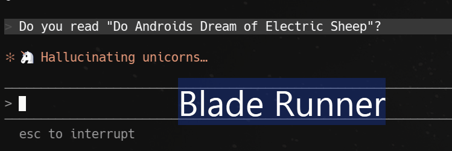

# claude-verbs

Changes the spinner words Claude Code shows while it's thinking. Pick a theme, make it fun.



Works with both **Claude Code CLI** and the **VSCode Claude extension**.

## Usage

```bash
npx claude-verbs
```

Run without arguments to open an interactive menu — use arrow keys to pick a theme and press Enter.

Or use CLI commands directly:

```bash
npx claude-verbs list              # List available themes
npx claude-verbs use <theme>       # Apply a theme
npx claude-verbs reset             # Reset to Claude Code defaults
npx claude-verbs current           # Show currently applied verbs
```

## Themes

| id | name | sample |
|----|------|--------|
| `lotr` | Lord of the Rings | "🧝 Consulting the elves" |
| `sw` | Star Wars | "✨ May the tokens be with you" |
| `dune` | Dune | "🏜️ Tokens must flow" |
| `matrix` | Matrix | "🧠 Downloading kung fu" |
| `bb` | Breaking Bad & Better Call Saul | "🧪 99.1% pure coverage" |

## How it works

Claude Code reads spinner verbs from `~/.claude/settings.json`. The VSCode Claude extension reads them from your VS Code `settings.json` under `claudeCode.spinnerVerbs`.

When you apply a theme, `claude-verbs` updates both:

- `~/.claude/settings.json` → `spinnerVerbs` (CLI)
- `~/AppData/Roaming/Code/User/settings.json` (Windows) or `~/Library/Application Support/Code/User/settings.json` (macOS) → `claudeCode.spinnerVerbs` (VSCode extension)

`reset` restores both to their defaults.

## License

MIT
