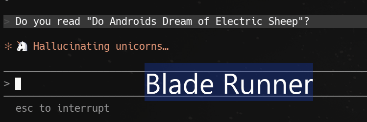
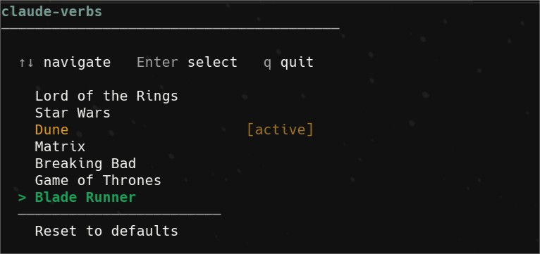

# claude-verbs

Replace Claude Code's thinking verbs with Star Wars, Game of Thrones, Lord of the Rings, Project Hail Mary, and more.



Works with both **Claude Code CLI** and the **VSCode Claude extension**. Supports macOS, Windows, and Linux.

## Usage

🚀 Just run this command:

```bash
npx claude-verbs
```

A menu will open — use arrow keys to pick a theme and press Enter.



✅ That's it.

---

Optionally, use CLI commands directly:

```bash
npx claude-verbs list              # List available themes
npx claude-verbs use <theme>       # Apply a theme
npx claude-verbs reset             # Reset to Claude Code defaults
npx claude-verbs current           # Show currently applied verbs
```

## Themes

| id | name | sample |
|----|------|--------|
| `lotr` | Lord of the Rings | "🌿 Waiting for the Ents to decide" |
| `sw` | Star Wars | "✨ May the tokens be with you" |
| `dune` | Dune | "🏜️ Tokens must flow" |
| `matrix` | Matrix | "📞 Looking for an exit" |
| `bb` | Breaking Bad | "🧪 99.1% pure coverage" |
| `got` | Game of Thrones | "🗡️ What do we say to PO? Not today." |
| `br` | Blade Runner | "🌧️ All those prompts lost in time... like tears in rain" |
| `phm` | Project Hail Mary | "❓ Question?" |

## How it works

Claude Code reads spinner verbs from `~/.claude/settings.json`. The VSCode Claude extension reads them from your VS Code `settings.json` under `claudeCode.spinnerVerbs`.

When you apply a theme, `claude-verbs` updates both:

- `~/.claude/settings.json` → `spinnerVerbs` (CLI)
- `~/AppData/Roaming/Code/User/settings.json` (Windows) or `~/Library/Application Support/Code/User/settings.json` (macOS) → `claudeCode.spinnerVerbs` (VSCode extension)

`reset` restores both to their defaults.

## Uninstall

```bash
npx claude-verbs reset
npm uninstall -g claude-verbs
```

## License

MIT
